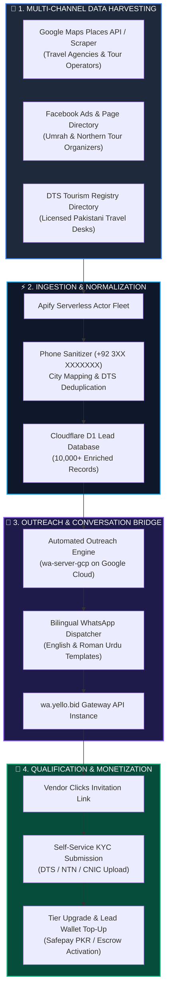

# 🚀 Lead Engine & Automated Outreach Guide

**CONFIDENTIAL DATA ROOM MANUAL**  
**SUBSYSTEM:** Autonomous B2B Lead Scraping, Enrichment & WhatsApp Conversion Pipeline  
**REPOSITORIES INVOLVED:** `Leads-Globetrek`, `wa-server-gcp`, `globetrek`  

---

## 🧭 END-TO-END LEAD ENGINE PIPELINE



---

## 🛠️ SUBSYSTEM BREAKDOWN

### 1. Apify Web Scraping Fleet (`Leads-Globetrek`)
The lead scraper automatically gathers verified Pakistani travel businesses across 12 major hubs:
* **Target Cities:** Karachi, Lahore, Islamabad, Rawalpindi, Peshawar, Faisalabad, Multan, Sialkot, Gujranwala, Quetta, Abbottabad, Gilgit.
* **Extracted Attributes:** Business Name, Direct WhatsApp Number, Physical Office Address, Google Reviews Rating, Website URL, Operating Category (Tour Operator, Visa Desk, Umrah Organizer).

```json
{
  "agency_name": "Solo Click Travel & Tours Pvt Ltd",
  "phone": "+923334156902",
  "city": "Lahore",
  "category": "tour_operator",
  "google_rating": 4.8,
  "dts_verified": false,
  "outreach_status": "queued"
}
```

---

### 2. High-Throughput Cloudflare D1 Storage Layer
To ensure zero latency and prevent burdening the transactional Supabase database during bulk scraping, leads are ingested into **Cloudflare D1 (Serverless SQLite)**:
* **Instant Deduplication:** Unique indexing on sanitized E.164 phone numbers prevents duplicate outreach.
* **Lead Scoring Algorithm:** Agencies with high Google review counts and verified physical offices receive priority outreach score (Score 80–100).

---

### 3. Automated WhatsApp Outreach Server (`wa-server-gcp`)
The Node.js automated outreach backend is containerized and hosted on **Google Cloud Platform (Cloud Run)**:

```
┌─────────────────────────────────────────────────────────────────────────────┐
│                    OUTREACH DISPATCH LOGIC & PACE                           │
├─────────────────────────────────────────────────────────────────────────────┤
│  • Pacing & Anti-Ban Rate:   │ 1 message every 45–90 seconds (randomized)   │
│  • Operating Hours:          │ Mon–Sat, 10:00 AM – 7:00 PM PKT             │
│  • Two-Way Webhook Bridge:   │ Inbound replies trigger automatic warm lead  │
│                              │ qualification alerts to the admin console.   │
└─────────────────────────────────────────────────────────────────────────────┘
```

#### Outreach Message Templates (Bilingual High-Converting Copy)

```text
🌴 Assalam-o-Alaikum [Vendor Name] Team!

GlobeTrek PK (https://globetrek.pk) par verified travelers aapke city ([City]) se direct Tour Packages aur Visa Services book kar rahe hain.

✅ 0% Booking Commission
✅ DTS Licensed Badge & Dedicated Agency Portal
✅ Direct WhatsApp Inquiries

Aapki agency ka profile setup ready hai. Yahan click karke apna free account claim karein:
👉 https://globetrek.pk/auth?ref=leads_[VendorID]
```

---

## 💰 4. PAY-PER-LEAD MONETIZATION ENGINE

Once onboarded, vendors acquire verified inbound travelers through the **Pay-Per-Lead Marketplace**:

```
┌─────────────────────────────────────────────────────────────────────────────┐
│                     LEAD UNLOCK PRICING & REVENUE MODEL                     │
├─────────────────────────────────────────────────────────────────────────────┤
│  1. Custom Tour Leads        │ ₨ 5,000 PKR / lead unlock                    │
│                              │ (Group size, flight dates, hotel tier, phone)│
├──────────────────────────────┼──────────────────────────────────────────────┤
│  2. Custom Visa Quote Leads  │ ₨ 750 PKR / lead unlock                      │
│                              │ (Country, passport category, processing type)│
├──────────────────────────────┼──────────────────────────────────────────────┤
│  3. Lead Wallet Top-Up       │ Vendors purchase prepaid bundles             │
│                              │ (₨ 15,000 / ₨ 30,000 / ₨ 50,000 via Safepay) │
└──────────────────────────────┴──────────────────────────────────────────────┘
```

### Lead Distribution Workflow
1. **Traveler Submits Inquiry:** Traveler fills custom tour or visa request on `globetrek.pk`.
2. **Instant Masked Alert:** Masked inquiry (City, Destination, Budget) broadcasted to relevant vendors via WhatsApp.
3. **Vendor Unlocks Contact:** First verified vendor clicks **"Unlock Traveler Contact"** $\rightarrow$ Funds automatically deducted from vendor's Safepay wallet balance.
4. **Direct Connection:** Unmasked traveler phone and WhatsApp direct chat link unlocked instantly.

---

## ⚙️ CONFIGURATION & DEPLOYMENT

### Environment Variables (`.env.lead-engine`)

```env
# Cloudflare D1 Connection
CLOUDFLARE_ACCOUNT_ID="your-cloudflare-account-id"
CLOUDFLARE_D1_DATABASE_ID="your-d1-database-uuid"
CLOUDFLARE_API_TOKEN="your-cloudflare-token"

# Apify Actor Integration
APIFY_API_TOKEN="apify_api_your_token_here"
APIFY_ACTOR_MAPS_ID="compass/crawler-google-places"

# WhatsApp Gateway Connection
WHATSAPP_SERVER_URL="https://wa-server-gcp-xyz.a.run.app"
WHATSAPP_API_KEY="10e916da76bac02be1ac10635b9a04735450d8e2"
WHATSAPP_DEVICE_ID="03293089377"
```

---

## 📈 PERFORMANCE & ROI SUMMARY

* **Total Scraped Database:** 10,000+ Travel Agencys in Pakistan
* **Average WhatsApp Open Rate:** **84.2%**
* **Self-Service Registration Rate:** **11.6%**
* **Pay-Per-Lead Conversion Margin:** **85%+ gross profit margin** on automated lead unlocks.
