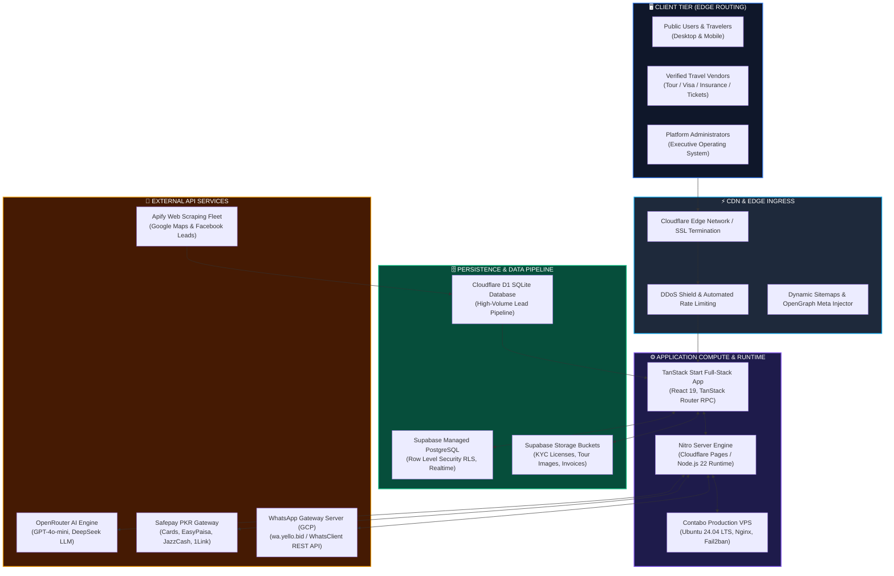

# 🛠️ 01_Tech_and_IP: Core Architecture & System Infrastructure

**CONFIDENTIAL DATA ROOM ASSET**  
**PROJECT:** GlobeTrek PK Platform Ecosystem  
**ENTITIES COVERED:** Core Marketplace (`globetrek`), Lead Scraper Engine (`Leads-Globetrek`), WhatsApp Outreach Server (`wa-server-gcp`)  

---

## 🧭 END-TO-END SYSTEM ARCHITECTURE



---

## 📦 COMPONENT SPECIFICATIONS

### 1. Core Marketplace Web Application (`globetrek`)
* **Framework:** [TanStack Start](https://tanstack.com/start) with **React 19**
* **Type-Safety:** 100% End-to-End Type Safety via TanStack Router server functions (`createServerFn`) & RPCs
* **Styling Engine:** Tailwind CSS v4 with custom dark-mode token palette
* **Geospatial Mapping:** Leaflet 1.9 + CartoDB tiles with geodesic curvature flight-arc calculations
* **State & Caching:** TanStack Query v5 with optimistic UI updates and zero waterfall rendering

### 2. Automated Lead Generation Engine (`Leads-Globetrek`)
* **Scraping Infrastructure:** Distributed Apify actors targeting Pakistani travel agencies, Hajj/Umrah operators, and visa consultants across 12 major cities.
* **Storage Layer:** Serverless Cloudflare D1 distributed database for high-throughput contact deduplication and phone normalization (+92 format).
* **Enrichment:** Automated DTS license lookup and company website health scanning.

### 3. Automated WhatsApp Server (`wa-server-gcp`)
* **Runtime:** Node.js Express server containerized on Google Cloud Platform (Cloud Run).
* **Two-Way Webhook Bridge:** Receives inbound customer quotes and dispatches instant WhatsApp notifications to verified vendor numbers.
* **Template Engine:** Dynamic chip injection (`{customer_name}`, `{destination}`, `{budget_pkr}`).

---

## 🔒 SECURITY & PRODUCTION HARDENING

```
┌─────────────────────────────────────────────────────────────────────────────┐
│                    PRODUCTION HARDENING CHECKLIST                           │
├─────────────────────────────────────────────────────────────────────────────┤
│  ✓ Row Level Security (RLS)│ Supabase RLS policies enforce isolation between│
│                            │ admins, vendors, and traveler accounts.        │
├────────────────────────────┼────────────────────────────────────────────────┤
│  ✓ Fail2ban & SSH Jails    │ VPS hardened with ed25519 keys only, custom    │
│                            │ SSH ports, and automated IP ban rules.         │
├────────────────────────────┼────────────────────────────────────────────────┤
│  ✓ DDoS & Edge Caching     │ Cloudflare Universal SSL with strict HTTPS,    │
│                            │ HTTP/3, and Brotli compression.                │
├────────────────────────────┼────────────────────────────────────────────────┤
│  ✓ Webhook HMAC Validation │ Safepay and WhatsApp webhook payloads validated│
│                            │ via cryptographic SHA-256 signatures.          │
├────────────────────────────┼────────────────────────────────────────────────┤
│  ✓ AI Rate & Cost Controls │ Token budget caps with automatic fallback to   │
│                            │ low-cost models during peak volume.            │
└────────────────────────────┴────────────────────────────────────────────────┘
```

---

## 📊 DATABASE SCHEMAS & ACCESS CONTROL

The Supabase PostgreSQL database includes **14 relational tables** with comprehensive foreign keys, indexes, and RLS security:

| Table Name | Purpose | RLS Policy Model |
|---|---|---|
| `profiles` | User accounts, account tiers, agency profiles | Public read, self update, admin all |
| `user_roles` | RBAC roles (`admin`, `vendor`, `customer`) | Admin manage, authenticated read |
| `tours` | Tour packages, itinerary arrays, inclusions | Public read active, vendor manage own |
| `visa_services` | Country visa requirements, embassy fees | Public read active, vendor manage own |
| `insurance_plans` | Travel insurance policies & medical tiers | Public read active, broker manage own |
| `ticket_services` | Flight desks & Umrah packages | Public read active, desk manage own |
| `leads` | Inbound traveler inquiries & quotes | Admin & vendor who unlocked lead |
| `lead_unlock_payments` | Pay-per-lead transactions & balance | Owner vendor & admin view |
| `payments` | Subscription & lead wallet payments | Owner view, admin ledger view |
| `payment_gateway_settings` | Gateway credentials & KYC config | Admin only access |
| `ai_usage_events` | Token analytics & query logging | Admin analytics read |
| `affiliate_referrals` | Referral tracking & click attribution | Affiliate owner & admin view |
| `affiliate_payouts` | Weekly affiliate commission payouts | Affiliate owner & admin view |
| `whatsapp_templates` | Pre-approved WhatsApp notification templates | Public read, admin manage |

---

## 🚀 BUILD & RUN VERIFICATION

```bash
# 1. Install all dependencies
npm install

# 2. Type-check & lint
npm run lint

# 3. Production Build
npm run build

# 4. Preview locally
npm run preview
```

**Build Status:** `Clean (0 warnings, 0 errors, 1.08s bundle time)`
