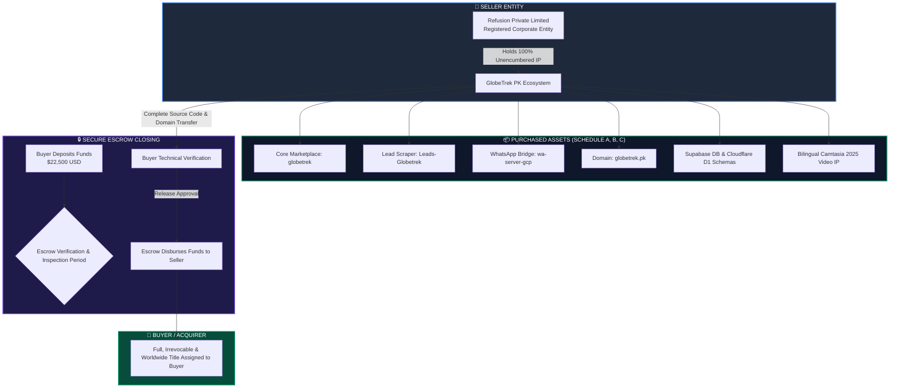
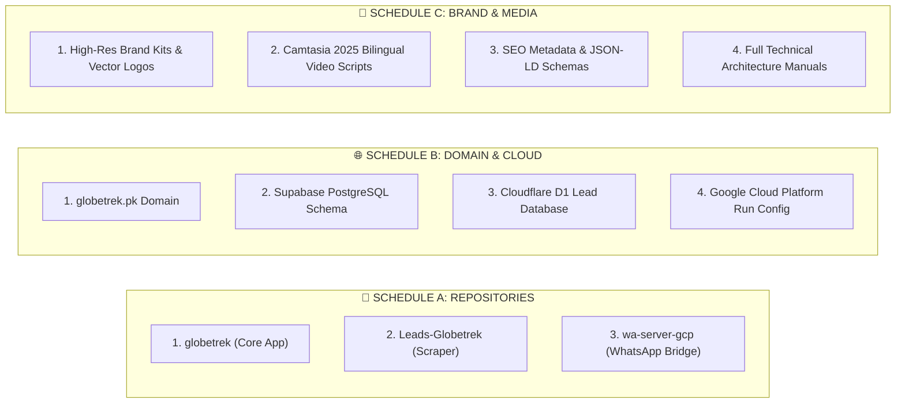

# 🏛️ INTELLECTUAL PROPERTY ASSIGNMENT AGREEMENT & BILL OF SALE

**DOCUMENT REF:** `REF-GTK-2026-APA-001`  
**EFFECTIVE DATE:** `[Insert Closing Date, e.g., 2026-09-01]`  
**TRANSACTION ESCROW ID:** `[Insert Escrow.com / Flippa Escrow Transaction ID]`  

---

## 📌 TRANSACTION ARCHITECTURE & CHAIN OF TITLE



---

## 📄 PARTIES TO THE AGREEMENT

This **Intellectual Property Assignment Agreement and Bill of Sale** (the *"Agreement"*) is made and entered into as of the Effective Date, by and between:

1. **THE SELLER (ASSIGNOR):**
   * **Company Name:** `Refusion Private Limited`
   * **Corporate Registration:** Registered under the Companies Act of Pakistan
   * **Authorized Representative:** `[Zulqarnain / Director Name]`
   * **Registered Address:** `[Insert Registered Office Address, Pakistan]`
   * **Notice Email:** `legal@refusion.io` / `admin@globetrek.pk`

2. **THE BUYER (ASSIGNEE):**
   * **Entity / Individual Name:** `[Insert Buyer Entity or Individual Name]`
   * **Registration / ID Number:** `[Insert Passport / Company Reg Number]`
   * **Address:** `[Insert Buyer Legal Address]`
   * **Notice Email:** `[Insert Buyer Email Address]`

*(The Seller and Buyer are collectively referred to as the **"Parties"** and individually as a **"Party"**).*

---

## 🧭 RECITALS

**WHEREAS**, Seller is the sole, absolute, and unencumbered owner of all right, title, and interest in and to the digital travel marketplace software, automated lead infrastructure, brand assets, source code repositories, databases, and associated intellectual property collectively known as **"GlobeTrek PK"**; and

**WHEREAS**, Seller desires to sell, convey, assign, transfer, and deliver to Buyer, and Buyer desires to purchase and acquire from Seller, all right, title, and interest in and to the Transferred Intellectual Property and Assets as set forth herein;

**NOW, THEREFORE**, in consideration of the mutual covenants, terms, and purchase price contained herein, the receipt and sufficiency of which are hereby acknowledged, the Parties agree as follows:

---

## 1. 💼 PURCHASE PRICE & ESCROW CLOSING MECHANISM

### 1.1 Total Purchase Price
The total agreed purchase price for the Transferred Assets is **$22,500 USD** (*Twenty-Two Thousand Five Hundred United States Dollars*), payable in full via escrow.

```
┌─────────────────────────────────────────────────────────────────────────────┐
│                       ESCROW SETTLEMENT LIFECYCLE                           │
├─────────────────────────────────────────────────────────────────────────────┤
│  Step 1: Escrow Creation   │  Buyer deposits $22,500 USD into Escrow.com /  │
│                            │  Flippa Escrow.                                │
├────────────────────────────┼────────────────────────────────────────────────┤
│  Step 2: Asset Delivery    │  Seller transfers 100% GitHub repos, domain,   │
│                            │  and cloud infrastructure within 48 hours.     │
├────────────────────────────┼────────────────────────────────────────────────┤
│  Step 3: Inspection Window │  Buyer receives 3 to 5 business days to verify │
│                            │  clean builds, domain auth code, and DB access.│
├────────────────────────────┼────────────────────────────────────────────────┤
│  Step 4: Final Settlement  │  Buyer marks inspection complete; Escrow       │
│                            │  releases funds to Seller. Title fully vests.  │
└────────────────────────────┴────────────────────────────────────────────────┘
```

---

## 2. 🛡️ ABSOLUTE TRANSFER OF INTELLECTUAL PROPERTY

### 2.1 Irrevocable Assignment
Seller hereby irrevocably, unconditionally, and perpetually grants, assigns, transfers, and conveys to Buyer, its successors, and assigns, **one hundred percent (100%) of all right, title, and interest worldwide** in and to the **Transferred Assets** (as cataloged in Schedules A, B, and C), including without limitation:

1. **All Source Code & Git Histories:** All frontend, backend, serverless, and database repository files across all past and current branches.
2. **All Copyrights & Moral Rights:** All copyrights, authorship rights, moral rights (to the fullest extent waivable by law), derivative work rights, and distribution rights.
3. **Trademarks & Trade Dress:** All rights in the trade name **GlobeTrek PK**, associated logos, UX designs, colour schemes, and domain identities.
4. **Trade Secrets & Algorithms:** All proprietary prompting architectures, lead qualification scoring algorithms, and WhatsApp webhook automation logic.
5. **Database Schemas & Data Assets:** All PostgreSQL schemas, Row Level Security (RLS) policies, relational models, and compiled travel catalogs.

---

## 3. 📦 SCHEDULE OF TRANSFERRED ASSETS



### SCHEDULE A: Software Repositories & Source Code
* **Core Marketplace Repository (`globetrek`):**
  * Built with TanStack Start (React 19), Nitro Server, Tailwind CSS v4, Radix UI.
  * Includes Bilingual AI Concierge (OpenRouter), Safepay PKR Payment Gateway, and Leaflet Geospatial mapping.
* **Lead Scraper & Enrichment Engine (`Leads-Globetrek`):**
  * Apify automation actors, city-precision geo-targeting, Cloudflare D1 storage.
* **Automated WhatsApp Bridge Backend (`wa-server-gcp`):**
  * Google Cloud Platform Node.js server with webhook receivers, automated quotation dispatchers, and template engines.

### SCHEDULE B: Domains & Cloud Infrastructure
* **Primary Domain:** `globetrek.pk` (EPP Authorization code transferred to Buyer registrar).
* **Database Infrastructure:** Complete Supabase PostgreSQL schema with RLS security policies, stored procedures (`search_marketplace`), and triggers.
* **API Configurations:** Complete environment variables template (`.env.production`), Safepay webhook certificates, and Google Cloud Run deployment scripts.

### SCHEDULE C: Digital & Creative Media Assets
* **Video Production Assets:** Full multi-module vendor training video scripts and master project files generated in Camtasia 2025 with bilingual English and Roman Urdu voiceover tracks.
* **Search Engine Optimizations:** Verified Google Search Console profiles, dynamic XML sitemaps, and validated JSON-LD schema graphs.

---

## 4. 📝 REPRESENTATIONS AND WARRANTIES

Seller (Refusion Private Limited) hereby warrants and represents to Buyer:

```
┌─────────────────────────────────────────────────────────────────────────────┐
│                     SELLER WARRANTIES & INDEMNIFICATION                     │
├─────────────────────────────────────────────────────────────────────────────┤
│  ✓ Sole Ownership          │ Seller is the exclusive legal owner of 100% of │
│                            │ the IP and has full authority to sell.         │
├────────────────────────────┼────────────────────────────────────────────────┤
│  ✓ Zero Encumbrances       │ Assets are free of all liens, mortgages, debt, │
│                            │ claims, or third-party security interests.     │
├────────────────────────────┼────────────────────────────────────────────────┤
│  ✓ Non-Infringement        │ Codebase does not infringe on any third-party  │
│                            │ copyrights, patents, or trade secrets.         │
├────────────────────────────┼────────────────────────────────────────────────┤
│  ✓ Open Source Compliance  │ All third-party libraries (React, Tailwind,    │
│                            │ Leaflet) are MIT/Apache-2.0 open source.       │
├────────────────────────────┼────────────────────────────────────────────────┤
│  ✓ Clean Transition        │ No ongoing litigation, claims, or disputes     │
│                            │ exist regarding the software or domain.        │
└────────────────────────────┴────────────────────────────────────────────────┘
```

---

## 5. 🤝 TRANSITION SUPPORT & POST-SALE COOPERATION

### 5.1 Developer Transition Support (30 Days)
Seller agrees to provide up to **thirty (30) consecutive calendar days** of technical handover assistance beginning on the closing date. Support includes:
* Direct Slack/Email communication for deployment queries.
* Assistance with Supabase, Cloudflare, and GCP DNS cutover.
* Configuration assistance for Buyer's Safepay and OpenRouter API keys.

### 5.2 Further Assurances
Seller agrees to execute and deliver any additional transfer deeds, domain registrar transfer confirmations, or IP assignment affidavits reasonably requested by Buyer to perfect Buyer’s absolute title.

---

## 6. ⚖️ GOVERNING LAW & DISPUTE RESOLUTION

This Agreement shall be governed by and construed in accordance with the laws governing commercial asset transactions. Any dispute arising out of or in connection with this contract shall be submitted to binding arbitration via the escrow platform's dispute resolution board or a mutually agreed international arbitration forum.

---

## ✍️ EXECUTION & SIGNATURES

**IN WITNESS WHEREOF**, the Parties hereto have executed this **Intellectual Property Assignment Agreement and Bill of Sale** by their duly authorized representatives as of the Effective Date.

### FOR SELLER:
**Refusion Private Limited**

\
By: ___________________________________________  
**Name:** `[Zulqarnain / Director Name]`  
**Title:** Authorized Director / Founder  
**Date:** `[Insert Date]`  
**Corporate Seal:** *(Signed & Sealed)*  

---

### FOR BUYER:
**[Insert Buyer Entity / Individual Name]**

\
By: ___________________________________________  
**Name:** `[Insert Buyer Representative Name]`  
**Title:** `[Insert Title / Individual Acquirer]`  
**Date:** `[Insert Date]`  
