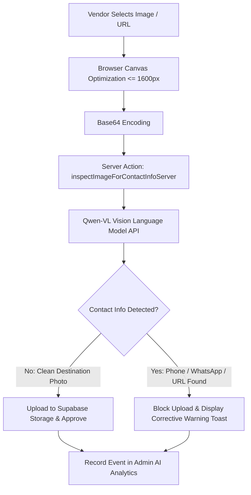

# Qwen-VL Image Moderation & Anti-Disintermediation Contact Shield 🛡️

## Executive Overview
The **Qwen-VL Visual Contact Shield** is GlobeTrek PK's automated multimodal AI moderation engine. It eliminates platform disintermediation (vendors attempting to bypass the B2B marketplace by embedding phone numbers, WhatsApp digits, external URLs, or agency marketing graphics inside tour cover photos and service banners).

---

## 1. Why Disintermediation Protection Matters
GlobeTrek PK connects verified tour operators, visa consultants, and ticketing desks with high-intent travelers. When vendors bake direct phone numbers into cover images:
- It degrades user experience by turning high-end travel listings into cluttered classified advertisements.
- It bypasses fair B2B lead bidding, lead unlock caps, and official SafePay payment dispute protection.
- It undermines marketplace trust and DTS (Department of Tourist Services) accreditation standards.

---

## 2. Technical Architecture & Vision Pipeline

### Supported AI Vision Models:
1. **`qwen-vl-plus`** *(Default)*: High-speed OCR (< 500ms latency), 1M free token tier on QwenCloud / DashScope.
2. **`qwen-vl-max`**: Maximum accuracy for handwritten, rotated, or stylized typography.
3. **`qwen2.5-vl-72b-instruct`**: Flagship vision-language model with multi-lingual Urdu and English digit recognition.
4. **`openai/gpt-4o-mini`**: Automatic OpenRouter fallback if QwenCloud quota or network limits are reached.

---

## 3. What the Scanner Detects
The visual scanner enforces zero tolerance for direct contact metadata on public imagery:

| Category | Patterns & Triggers Detected |
| :--- | :--- |
| **Pakistani Mobile Numbers** | `0300`, `0321`, `0333`, `0345`, `+92-3xx-xxxxxxx`, formatted or spaced digits |
| **WhatsApp Contact Badges** | WhatsApp green logos with overlaid numbers, `"DM for booking"`, `"WhatsApp Us"` |
| **Direct Contact CTAs** | `"Call now for discount"`, `"Contact: 051-xxxxxxx"`, `"Call Office: ..."` |
| **External URLs & Emails** | `.com`, `.pk`, `.travel`, `info@agency.com`, `@agency_handle` |
| **Heavy Watermark Flyers** | Promotional promotional banners dominating > 20% of the image canvas |

---

## 4. Vendor Workflow & Experience

### A. If the Image is Clean:
The image is compressed, uploaded to Supabase Storage (`tour-images/`), and assigned an encrypted signed URL. A success toast confirms:
> ✨ *"Image verified & uploaded"*

### B. If Contact Info is Detected:
The upload is **instantly aborted** before storage. The vendor receives an educational notification:
> ⚠️ **"Direct Contact Info Detected on Image!"**  
> *"Platform rules strictly prohibit embedding phone numbers, WhatsApp digits, or agency contact watermarks in cover images. Please upload clean destination photography."*

---

## 5. Admin AI Dashboard Controls
Administrators can monitor and manage the visual contact shield from **`/admin/ai`**:
- **Preset Model Selector**: Switch active models on the fly between `qwen-vl-plus`, `qwen-vl-max`, `qwen2.5-vl-72b-instruct`, or custom models.
- **Latency & Token Metrics**: View real-time token consumption, latency, and success rates.
- **Health Verification**: Test live vision model connectivity with the `"Verify & Test Active Model"` action.

---

## 6. Public Documentation Locations
- **Enterprise Capabilities**: [`/enterprise`](file:///src/routes/enterprise.tsx) (Feature Matrix & AI Tool #5).
- **Vendor Operating Guide**: [`/vendor-guide`](file:///src/routes/vendor-guide.tsx) (Chapter: *Cover Image Policy & Qwen-VL Contact Shield*).
